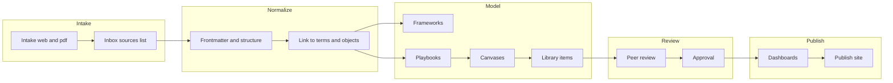

# Цель
Обеспечить повторяемое производство, хранение и публикацию знаний PIK в формате Единой Правды (SSOT) на базе Obsidian.

# Область применения
- Фреймворки, плейбуки, канвасы, артефакты, метрики, термины, библиотека источников.
- Командная работа через Sync и Git, публикация через Publish.

# Принципы (Доктрина)
- Все артефакты — **Markdown + свойства**. Файлы первичны и независимы.
- Каждая сущность — **одна заметка** со стабильным **id** и **type**.
- Любая связь — **вики-ссылка**. Без ссылок нет графа.
- Визуализации — **Canvas** для операций, **draw.io** и **mermaid для строгих схем.
- Изменения — через **review** и **аудит**. Источник истины — ветка main.
- Публикация — **отдельная выборка** файлов. Приватное остаётся приватным.

# Роли и обязанности
| Роль      | Ответственность                               | R   | A   | C   | I   |
| --------- | --------------------------------------------- | --- | --- | --- | --- |
| Owner     | Доктрина, чартер репозитория, эскалации       |     | X   | C   | I   |
| Librarian | Схема полей, глоссарий, наполнение библиотеки | X   |     | C   | I   |
| Producer  | Создание контента, первичное связывание       | X   |     |     | I   |
| Editor    | Нормализация, язык, структура                 |     |     | X   |     |
| Reviewer  | Проверка по чек-листу качества                |     |     | X   |     |
| Publisher | Выборка и выпуск Publish                      |     |     | C   | X   |
| Admin     | Плагины, доступы, бэкапы                      |     |     | C   | I   |

# Схема потоков


# Глоссарий и свойства
Минимальный набор свойств для всех артефактов:
```yaml
type: <framework|playbook|canvas|term|library_item|artifact|metric>
id: <namespace-stable-id>
title: <читаемое имя>
status: <draft|review|approved|archived>
version: "<semver>"
owner: <ответственный>
source_org: <источник>
source_url: <ссылка>
source_date: <yyyy-mm-dd>
tags: [PIK, ...]
```

# Стандарты именования
- Файлы: `PIK-FRM-<slug>.md`, `PIK-PBK-<slug>.md`, `TERM-<slug>.md`.
- Заголовки H1 = `title`. Алиасы хранить в `aliases`.
- Диаграммы: `*.canvas` рядом с дашбордами, `*.drawio` в `_Diagrams/drawio`.

# Процессы и чек-листы

## 1. Intake источников
**Вход:** веб-страницы, PDF, заметки.  
**Шаги:**
- Захватить страницу через Web Clipper в `_Sources/Web` по шаблону.
- Положить PDF в `_Sources/PDF` и создать `library_item` с метаданными.
- Добавить запись в журнал intake `00_Admin/Intake/intake.md`.
**Выход:** источники со свойствами и ссылками на оригиналы.

## 2. Нормализация
**Шаги:**
- Создать каноническую заметку из шаблона Templater.
- Заполнить обязательные свойства, добавить one-liner и краткое summary.
- Связать: `related_terms`, `related_playbooks`, `related_canvases`.
- Вставить ключевые фрагменты через трансклюзии `![[...]]` при необходимости.

## 3. Моделирование и связывание
**Шаги:**
- Разбить материалы на атомарные заметки.
- Создать MOC-хабы для доменов и уровней PIK.
- Проверить локальный граф: нет ли осиротевших заметок.
- Обновить Canvas‑карту потока.

## 4. Ревью и утверждение
**Критерии качества (DoD):**
- Заполнены все обязательные свойства и id.
- Линки на термины и связанные сущности присутствуют.
- Нет орфографических ошибок и повторов.
- Диаграммы читаемы, файлы на местах.
**Решение:** статус `approved` проставляет Owner или Reviewer.

## 5. Публикация
**Шаги:**
- Сформировать выборку публикации (список include).
- Проверить приватные пометки и файлы — они не уходят наружу.
- Выпустить через Publish. Обновить дату версии и release notes.

## 6. Сопровождение и эволюция
**Ритмы:**
- Daily: быстрый intake, связывание, 15 минут на граф.
- Weekly: ревью новых артефактов, дашборд метрик.
- Monthly: рефакторинг схемы полей, чистка тегов, бэкап.

# Правила ссылок и блоков
- Для фрагментов использовать якоря блоков: `^id`.
- Для врезок — `![[note#section or ^id]]`.
- Для типовых отношений:
  - `related_to:: [[...]]`
  - `uses:: [[...]]`
  - `delivers:: [[...]]`
  - `part_of:: [[...]]`

# Технический стек
- Core: Properties, Canvas, Bases, Publish, Sync.
- Community: Dataview, Templater, Obsidian Git, Text Extractor, QuickAdd, Advanced URI.
- Диаграммы: Mermaid, draw.io.

# Метрики качества знаний
- Coverage: доля фреймворков и плейбуков с каноническими заметками.
- Freshness: медианный возраст последних правок.
- Link density: среднее число исходящих ссылок на заметку.
- Orphan rate: доля осиротевших заметок.
- Publish latency: время от approve до публикации.

# Риски и контроль
- Риск: разнобой свойств. Контроль: валидатор свойств и шаблоны.
- Риск: приватные данные в публикации. Контроль: список include, ревью.
- Риск: потеря истории. Контроль: Git + Sync + бэкапы.

# Приложения
- Пример frontmatter для Framework, Playbook, Term — см. шаблоны в `_Templates`.
- Дашборды: `PIK-SSOT-dashboard.md`.
- Карты: `PIK-SSOT.canvas`, `PBK-Obsidian-SSOT.canvas`.
