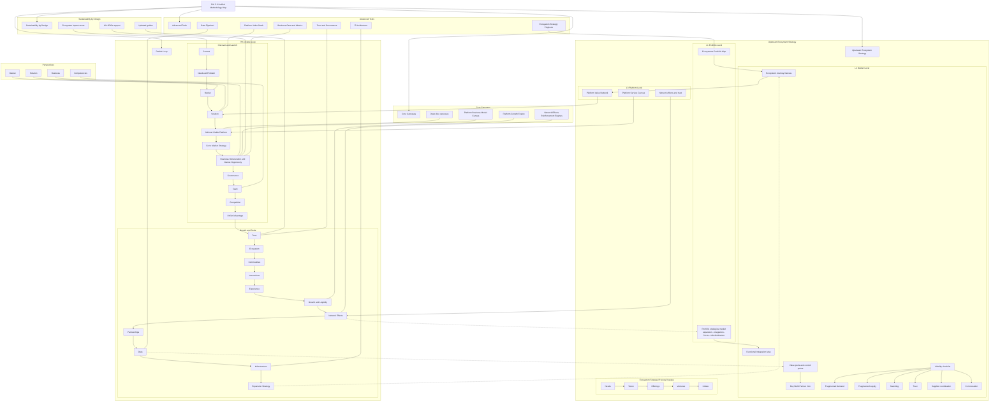

> Схема подготовлена в соответствии с доктриной Obsidian SSOT. Для импортирования — поместите файл в хранилище и откройте. fileciteturn2file0

# Unified Methodology Map

^diagram-unified

## Примечания
- Названия узлов совпадают с именами будущих заметок для простого связывания вручную через вики-ссылки.
- Рекомендуется завести MOC узлы для уровней L1 L2 L3 и для петли Double Loop.
- Для операционки используйте Canvas карты `PIK-SSOT.canvas` и `PBK-Obsidian-SSOT.canvas` рядом с этой схемой.
